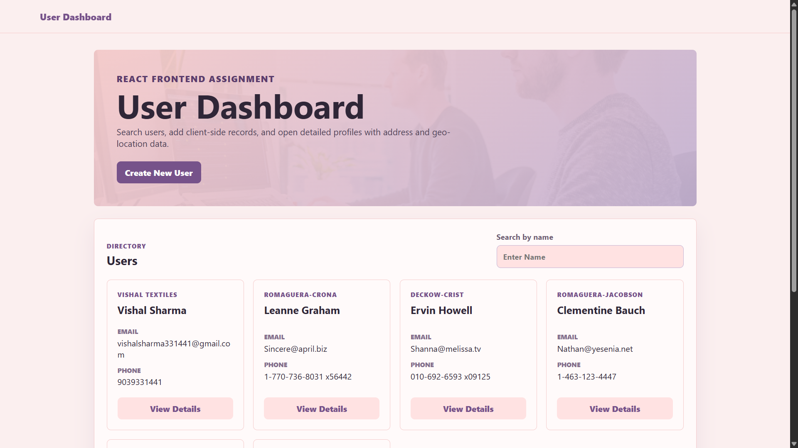
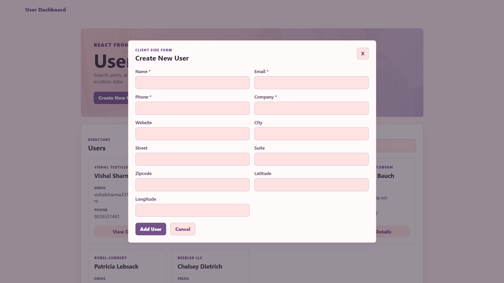
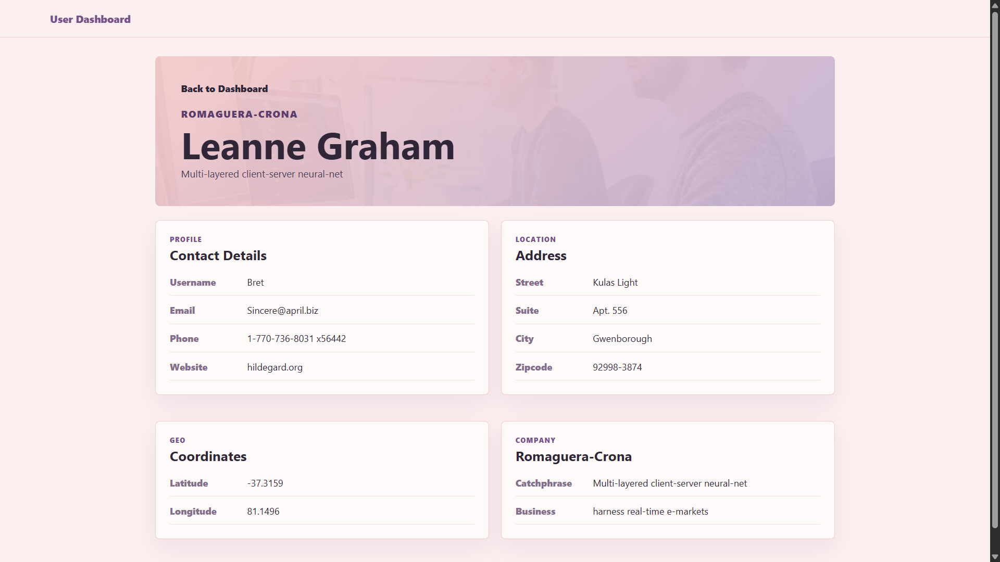
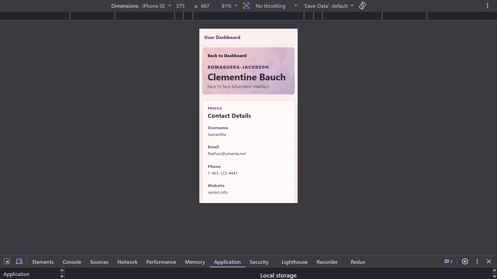

# User Dashboard

A responsive React.js User Dashboard built for the React Frontend Intern Assignment. The app fetches users from an API, displays them in cards, supports search, pagination, client-side user creation, and a user details page with address and geo-location information.

## Live Links

- Live Demo: Add your Netlify [link here](https://vishal-dashboard-app.netlify.app/)
- GitHub Repository: [frontend-assign](https://github.com/Vishal-508/frontend-assign)

## Assignment Objective

Build a small User Dashboard app using React.js.

## Features

- Fetch users from `https://jsonplaceholder.typicode.com/users`
- Display user name, email, phone, and company name in cards
- Search/filter users by name
- Create new user using a client-side modal form
- Store users globally using React Context API
- Persist newly created users in `localStorage`
- User details page using React Router DOM
- Show full user details including address and geo-location
- Pagination on dashboard user list
- Loading, error, empty, and 404 states
- Fully responsive layout for mobile and desktop

## Tech Stack

- React.js
- Vite
- React Router DOM
- Axios
- React Context API
- React Hooks
- CSS Grid and Flexbox
- Netlify for deployment

## Requirements Covered

| Requirement | Status |
| --- | --- |
| Fetch and display users from API | Done |
| Show name, email, phone, company name | Done |
| Search/filter by name | Done |
| Create New User form | Done |
| Global user state with Context API | Done |
| User Details page with React Router | Done |
| Show address and geo-location | Done |
| Mobile responsive design | Done |
| README with setup instructions | Done |
| Screenshots section | Added |

## Project Structure

```txt
src/
  api/
    usersApi.js
  components/
    ErrorMessage.jsx
    Loading.jsx
    Modal.jsx
    Pagination.jsx
    SearchBar.jsx
    UserCard.jsx
    UserForm.jsx
  context/
    UserContext.jsx
  hooks/
    useUsers.js
  pages/
    Dashboard.jsx
    NotFound.jsx
    UserDetails.jsx
  styles/
    global.css
  App.jsx
  main.jsx
```

## Installation and Setup

Clone the repository:

```bash
git clone https://github.com/Vishal-508/frontend-assign.git
```

Go to the project folder:

```bash
cd frontend-assign/frontend-assign
```

Install dependencies:

```bash
npm install
```

Start the development server:

```bash
npm run dev
```

Open the local URL shown in the terminal, usually:

```txt
http://localhost:5173
```

## Build for Production

```bash
npm run build
```

Preview production build locally:

```bash
npm run preview
```

## Netlify Deployment

Since the React project is inside the `frontend-assign` folder, use these Netlify build settings:

```txt
Base directory: frontend-assign
Build command: npm run build
Publish directory: dist
```

The project includes Netlify routing support for React Router:

```txt
public/_redirects
netlify.toml
```

This prevents 404 errors when refreshing routes like `/users/1`.

## Screenshots

Add your screenshots in a `screenshots` folder and update the image paths below.

### Dashboard



### Create New User Modal



### User Details Page



### Mobile View



## Main Pages

### Dashboard Page

The dashboard page displays all users in a responsive card layout. It includes search, pagination, and a button to open the Create New User modal.

### User Details Page

Clicking on a user opens a details page. It displays contact details, company details, address, and geo-location.

### Not Found Page

Invalid routes show a simple 404 page with a link back to the dashboard.

## Additional Improvements Added

- Modal-based create user form
- Form validation
- Pagination
- `localStorage` support for created users
- Reusable components
- CSS variables for easy theme and layout changes
- Netlify deployment configuration

## Available Scripts

```bash
npm run dev
```

Runs the app in development mode.

```bash
npm run build
```

Builds the app for production.

```bash
npm run preview
```

Previews the production build locally.

```bash
npm run lint
```

Runs ESLint checks.

## API Used

```txt
https://jsonplaceholder.typicode.com/users
```

## Author

Vishal
